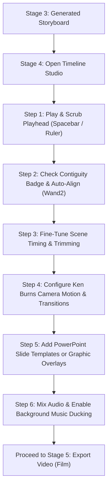

# Scenora AI Video Maker — Stage-by-Stage Production Manual

> **Living Platform Manual**: This document tracks the complete anatomy, architectural improvements, bug fixes, and operational tutorials for each stage of the Scenora SaaS video pipeline. It is updated after every stage audit and refinement.

---

## The 5-Stage Video Pipeline
1. **Stage 1: Script & Audio / Master Timeline** — Audio ingestion, Edge-TTS synthesis, sentence timecodes, and contiguous timeline locking. *(Completed & Audited)*
2. **Stage 2: Video Bible Consistency Engine** — Visual continuity for characters, locations, key props, artistic style, and prompt rules. *(Completed & Audited)*
3. **Stage 3: Visual Storyboard & AI Generation** — Scene-by-scene AI prompt synthesis, multi-provider image rendering (Flux, Cloudflare, OpenAI, Local GPU, Mock), A/B variations, and graphic cards. *(Completed & Audited)*
4. **Stage 4: Timeline Studio & Motion Engine** — Animation dynamics, camera pans/zooms, transitions, slide studio, multi-track audio mixing, and audio-visual syncing. *(Completed & Audited)*
5. **Stage 5: Export & Deliver** — High-definition MP4 rendering, captions burning, audio mixing, and multi-format delivery. *(Next)*

---

## Stage 1: Script & Audio / Master Timeline

### 1. Overview & Purpose
In professional AI video production, the **Master Timeline** is the foundational audio-visual clock. It divides narration into contiguous scene blocks (`SC_001`, `SC_002`, ...) with strict second-level timestamps (`start` and `end`). Every downstream stage (Video Bible entity extraction, storyboard prompt scoping, and final MP4 rendering) relies directly on the Master Timeline.

### 2. Complete Inventory of Fields & Controls

#### A. Ingestion Modal (`ImportProject.tsx`)
- **Project Name** (`input text`): Sets the title of the video project.
- **Ingest Mode Switcher** (`tabs`):
  - **Clipchamp Captions + Audio**: For creators uploading pre-recorded voiceovers and timestamped `.srt`/`.vtt` captions.
  - **Script to Voiceover (TTS)**: For creators generating narration from raw text using Microsoft Edge-TTS neural voices.
- **Clipchamp Captions Input** (`textarea`): Accepts exported timestamped captions (e.g., `00:00:01,000 --> 00:00:04,500`).
- **Audio File Dropzone** (`file input`): Uploads master voiceover (`.mp3`, `.wav`, `.m4a`, `.aac` up to 50MB).
- **TTS Script Textarea** (`textarea`): Plain text script input for AI neural voice synthesis.
- **AI Voice Selector** (`dropdown`): Selects neural voices (e.g. *Guy Neural*, *Jenny Neural*, *Andrew Neural*, *Sonia Neural*).
- **Voice Rate & Pitch Sliders** (`range inputs`): Adjusts speaking pace (`-50%` to `+50%`) and tone pitch.
- **"Build Master Timeline"** (`primary button`): Submits audio/script, calculates sentence timecodes, establishes the scenes, and unlocks the workspace.

#### B. Timeline Table & Workspace (`SceneTable.tsx` & `Workspace.tsx`)
- **Contiguity Status Pill**:
  - Green (`✓ Contiguous Timeline`): All scenes transition back-to-back with 0 gaps.
  - Orange (`⚠️ Timing Issues`): Highlights detected silence gaps or audio overlaps.
- **Master Audio Player**: HTML5 audio bar to preview the full master voiceover track with file size and duration stats.
- **"Auto-Align Timestamps" Button (`Wand2`)**: 1-click healing action that automatically eliminates all timing gaps and overlaps.
- **"+ Add Scene" Button (`Plus`)**: Appends a contiguous new scene block to the end of the timeline without requiring manual timestamp math.
- **Scene Row Controls**:
  - **Scene Tag** (`SC_001`, `SC_002`): Live pulsing indicator when that scene's audio is playing.
  - **Start / End (s)**: Numerical inputs with 0.1s step precision for fine-tuning cut points.
  - **Duration (s)**: Dynamic readout of `end - start`.
  - **Caption Narration**: Editable dialogue/narration text for that scene block.
  - **Listen Button (`Play`/`Pause`)**: Plays audio strictly within that scene's time window (`start` to `end`).
  - **Edit / Save / Cancel**: Commits row modifications with toast confirmation.
  - **Delete Scene (`Trash2`)**: Deletes scene and ripples downstream timestamps forward.
- **Inline Warning Strip**: Appears between scenes if a silence gap (e.g., `1.2s silence gap`) or overlap exists, complete with an inline `Auto-align timing` shortcut.
- **"Proceed to Stage 2: Video Bible"**: Guided navigation button advancing the project to Character & Visual Consistency setup.

---

### 3. How to Use Stage 1 (Step-by-Step)

#### Step 1: Create or Ingest a Project
1. Open the project creation or import modal.
2. Enter your **Project Name**.
3. Choose your ingestion method:
   - **If you have an audio file & captions**: Select *Clipchamp Captions + Audio*, upload your audio file, and paste your timestamped captions.
   - **If you only have a script**: Select *Script to Voiceover (TTS)*, choose your preferred AI voice, adjust speech rate, and paste your script.
4. Click **"Build Master Timeline"**. The progressive indicator will display:
   - *“Synthesizing neural AI voiceover...”* &rarr; *“Analyzing speech boundaries & sentence timecodes...”* &rarr; *“Building Master Timeline scenes...”*

#### Step 2: Review and Fine-Tune Timestamps
1. Look at the top status badge. If you see `✓ Contiguous Timeline`, your timestamps are seamless.
2. If you see `⚠️ Timing Issues` (e.g. from manual edits or uneven speech pauses):
   - Review the yellow warning strips between scenes.
   - Click **"Auto-Align Timestamps"** to automatically eliminate all silence gaps in 1 click.
3. To adjust narration or split a scene's duration, click **Edit** on that row, update the start/end numbers or text, and click **Save**.
4. To listen to any specific scene's narration, click the **Listen** button on that row.
5. To append an extra scene (e.g. for an outro or extra takeaway), click **"+ Add Scene"**.

#### Step 3: Advance to Stage 2
1. Once all scenes and timestamps look accurate, click **"Proceed to Stage 2: Video Bible"** at the bottom navigation bar.

---

### 4. Stage 1 Audit & Production Upgrades Done
- **Storage Latency Bottleneck Solved**: Converted blocking Google Cloud Storage multipart uploads in `asset_storage.py` to non-blocking background threads (`ThreadPoolExecutor`). Local storage returns in **~2ms** instead of freezing the server for 3–15 seconds.
- **Progressive Feedback**: Added multi-phase progress messages during voice synthesis and upload to eliminate UI freeze perception.
- **Contiguity Diagnostics & 1-Click Healing**: Added automatic gap/overlap detection in `SceneTable.tsx` paired with backend `auto_align_scenes` in `project_service.py` and `POST /timeline/auto-align`.
- **Scene Management Endpoints**: Implemented `POST /timeline/scenes`, `POST /timeline/slides`, and `delete_scene` with ripple adjustments.

---

## Stage 2: Video Bible Consistency Engine

### 1. Overview & Purpose
Generative image models (Flux, Stable Diffusion, Imagen) suffer from **style drift**, face changes, and inconsistent wardrobe across scenes. The **Video Bible** prevents this by serving as the central continuity database:
- It defines character faces, outfits, and traits.
- It anchors environmental backdrops and lighting for locations.
- It specifies key recurring props and hero items.
- It locks in overarching cinematography (visual style, camera lens, color grade, realism level).
- It injects strict negative and positive rules into every downstream AI prompt.

---

### 2. Complete Inventory of Fields & Controls

#### A. Header Controls (`VideoBibleEditor.tsx`)
- **"AI Auto-Extract Bible" (`Sparkles`)**: Scans all script narration from Stage 1 using LLM analysis to automatically detect recurring characters, locations, props, and art tone.
- **Refresh Bible Data (`RefreshCw`)**: Re-synchronizes Bible data from server state.
- **"Inspect Prompt Context" (`Eye`)**: Opens the **Visual Context Drawer**, displaying the exact compiled prompt fragment generated by `build_visual_context()`.
- **Sub-Navigation Tabs with Badges**:
  - `Overall Style`
  - `Characters (N)`: Quantity pill showing active character count.
  - `Locations (N)`: Quantity pill showing active location count.
  - `Key Objects (N)`: Quantity pill showing active object count.
  - `Global Rules (N)`: Quantity pill showing active rule count.
- **First-Time Guidance Banner**: Displays when 0 characters/locations exist, providing a 1-click **"Auto-Extract Now"** CTA.

#### B. Overall Style Section (`OverallStyleSection.tsx`)
- **Quick-Apply Curated Style Pills**:
  - *Cinematic Film* (Photorealistic 35mm, atmospheric rim lighting)
  - *Documentary* (Available-light verité realism, 50mm natural depth)
  - *Stylized 3D Animation* (Vibrant dimensional textures, bounce lighting)
  - *2D Anime / Manga* (Cel-shaded expressive illustrated angles)
  - *Hand Drawn Sketch* (Organic pencil/ink on paper, minimal background)
  - *Vintage 1980s Film* (Warm retro tungsten, golden flares, film grain)
- **Visual Style** (`text input`): Custom style definition (e.g. *Cyberpunk Noir*, *High-Fantasy Epic*).
- **Realism Level** (`dropdown`): *Photorealistic*, *Hyperrealistic*, *Stylized 3D Animation*, *2D Anime / Manga*, *Oil Painting*, *Vintage Film Grain*.
- **Mood & Atmosphere** (`text input`): Emotional tone (e.g. *Tense, contemplative, dystopian*).
- **Lighting Treatment** (`textarea`): Detailed lighting direction (e.g. *Directional rim light, volumetric fog*).
- **Color Grading & Palette** (`textarea`): Color grading instructions (e.g. *Teal and orange, high contrast*).
- **Camera Style & Angles** (`text input`): Framing directives (e.g. *Eye-level medium shots, slow tracking push-in*).
- **Lens & Cinematography** (`text input`): Focal length and optics (e.g. *35mm anamorphic prime lens, f/1.8 shallow depth*).
- **"Save Style Settings" Button**: Persists style settings with instant visual confirmation.

#### C. Characters Section (`CharactersSection.tsx`)
- **"Add Character" Button (`Plus`)**: Opens modal to create a new character.
- **Character Modal Fields**:
  - `Name` (required): Character identity.
  - `Age Range`: Age bracket (e.g. *Late 20s*, *Middle-aged*).
  - `Appearance / Look`: Facial structure, hair, build, distinguishing marks.
  - `Clothing / Outfit`: Standard wardrobe across scenes.
  - `Personality Traits`: Temperament and expressions.
  - `Role / Description`: Narrative function.
- **Character Card**:
  - Reference photo thumbnail with upload overlay.
  - Summary of Look, Outfit, and Traits.
  - **"Upload Photo" / "Change Photo"**: Attaches a face reference image.
  - **"Remove Photo" (`X`)**: Clears reference photo without deleting the character.
  - **Edit (`Edit3`) / Delete (`Trash2`)**: Modifies or removes character.

#### D. Locations Section (`LocationsSection.tsx`)
- **"Add Location" Button (`Plus`)**: Opens modal to define an environment.
- **Location Modal Fields**:
  - `Name` (required): Place name (e.g. *Neo-Tokyo Alleyway*, *Victorian Study*).
  - `Environment`: Architectural details, climate, weather, textures.
  - `Lighting`: Ambient lighting conditions.
  - `Description`: General notes.
- **Location Card**:
  - Photo thumbnail with upload trigger.
  - Tags for Environment and Lighting.
  - **"Ref Image Active" / "Remove"**: Detaches location reference image in 1 click.
  - **Edit / Delete Buttons**: Full CRUD management.

#### E. Key Objects Section (`ObjectsSection.tsx`)
- **"Add Object" Button (`Plus`)**: Opens modal for recurring hero items.
- **Object Modal Fields**:
  - `Name` (required): Item name (e.g. *Vintage Leather Journal*, *Energy Core*).
  - `Description`: Visual features, materials, and colors.
- **Object Card**:
  - Thumbnail, upload action, 1-click reference removal, edit, and delete.

#### F. Global Rules Section (`GlobalRulesSection.tsx`)
- **Preset Rule Toggles**: 8 toggleable directives (*Cinematic*, *Realistic*, *Documentary*, *Animation*, *Historical*, *Futuristic*, *Noir*, *Anamorphic*).
- **Custom Rule Input**: Add custom negative or positive directives (e.g., *“No distorted hands or faces”*, *“Warm sunset tint on all metals”*).
- **Active Rule Tags**: Click `X` on any active badge to remove it.

#### G. Visual Context Drawer (`VisualContextDrawer.tsx`)
- Displays live output from `build_visual_context()`:
  - Full synthesized style prompt fragment.
  - Character prompt descriptors.
  - Location prompt descriptors.
  - Active rules and reference images catalog.
- **"Copy" Button**: Copies the compiled context to clipboard for testing in external AI image tools.

---

### 3. How to Use Stage 2 (Step-by-Step)

#### Step 1: Initialize Visual Continuity
1. Arrive at **Stage 2** from Stage 1.
2. If this is a new project, click **"AI Auto-Extract Bible"** (or click **"Auto-Extract Now"** in the top banner).
3. The AI scans your narration script and automatically generates:
   - Appropriate visual style & cinematography parameters.
   - Identified recurring characters with appearances and outfits.
   - Recurring locations and settings.
   - Essential negative visual rules.
4. The view automatically switches to the **Characters** tab to show your cast.

#### Step 2: Pick or Fine-Tune the Visual Style
1. Switch to the **Overall Style** tab.
2. Click any of the **Quick-Apply Curated Style Presets** (e.g., *Cinematic Film*, *Stylized 3D*, or *Anime*) to instantly set matching lens, color grading, lighting, and camera settings.
3. Optionally adjust specific fields (like *Mood* or *Color Grading*) to fit your exact creative vision.
4. Click **"Save Style Settings"**.

#### Step 3: Refine Characters & Upload Reference Photos
1. Switch to the **Characters** tab.
2. Click **Edit** on any character card to adjust appearance, clothing, or age range.
3. If you have a specific character face photo:
   - Click **"Upload Photo"** on the card and choose a `.png` or `.jpg`.
   - The photo is saved to durable cloud storage with local fast caching.
   - If you ever want to revert to pure text descriptions, click **"Remove"** next to *Ref Image Active*.
4. Click **"+ Add Character"** to add any additional characters not detected in the script.

#### Step 4: Configure Locations & Rules
1. Switch to **Locations** to review or add your project's environments.
2. Switch to **Global Rules** to enable presets like *Cinematic* or add custom rules like *“Strict 16:9 framing with no text overlays”*.
3. Click **"Inspect prompt context"** in the top header to preview the exact text block that will be passed into AI image models in Stage 3.

#### Step 5: Advance to Stage 3
1. When satisfied with your visual bible, click **"Proceed to Stage 3: Storyboard"** at the bottom navigation bar.

---

### 4. Stage 2 Audit & Production Upgrades Done
- **Stale State Sync Resolved**: Added `useEffect` in `OverallStyleSection.tsx` so that when AI Auto-Extract or project reload occurs, all style inputs update immediately.
- **Reference Image Deletion**: Added backend `delete_reference_image` in `project_service.py` and `DELETE /projects/{id}/bible/{entity_type}/{id}/reference` endpoints, paired with frontend API client methods and 1-click "Remove" buttons on character/location/object cards.
- **Markdown JSON Code Block Sanitization**: Added fence cleaning regex in `auto_extract_video_bible` so LLM responses wrapped in ` ```json ... ``` ` parse without crashing.
- **Curated Style Presets**: Added 6 one-click style presets in `OverallStyleSection.tsx` matching the backend visual style engine.
- **Tab Badges & First-Time Guidance**: Added item count badges on all tabs and an empty state banner in `VideoBibleEditor.tsx`.

---

## Stage 3: Visual Storyboard & AI Generation

### 1. Overview & Purpose
Stage 3 transforms the Master Timeline sentences and Video Bible continuity database into a living, visual storyboard:
- It compiles comprehensive, cinematic AI image prompts that combine narration context, character identities, wardrobe, location lighting, camera angles, and negative rules.
- It interfaces with multiple generative AI image providers (Free Cloud, Cloudflare Workers AI, Local SANA GPU, OpenAI, Gemini, and offline Mock).
- It enables rapid directorial tweaking, parallel candidate generation (A/B testing), custom image uploads from disk, and 1-click graphic card templates.
- It provides non-destructive scene clustering and merging to cure rapid, strobe-like subtitle pacing.

---

### 2. Complete Inventory of Fields & Controls

#### A. Storyboard Command Header (`StoryboardHeader.tsx`)
- **Title & Aspect Ratio Pill**: Displays active project aspect ratio badge (`16:9`, `9:16`, or `1:1`).
- **Telemetry Stat Chips**:
  - `Scenes Count`: Total scenes on the Master Timeline.
  - `Prompts Ready`: Number of scenes with synthesized image prompts.
  - `Ready Count` (Green): Number of scenes with completed high-res visual assets.
  - `Failed Count` (Red): Count of scenes that encountered generation errors.
  - `Pending Count` (Amber): Count of scenes awaiting visual synthesis.
- **AI Image Model Picker Dropdown (`Cpu`)**:
  - Categorized menu displaying:
    - *Free Cloud (Zero Setup / Unlimited)*: e.g. Flux Realism, Flux Anime, SDXL.
    - *Cloudflare Workers AI (Daily Quota)*: Cloudflare @cf/black-forest-labs/flux-1-schnell with live daily quota readout.
    - *Local Machine (Offline GPU)*: SANA-Sprint local offline generator.
    - *Advanced Cloud (API Keys Required)*: OpenAI DALL-E 3, Gemini Imagen 3 with `ACTIVE KEY` or `NEEDS KEY` badges.
    - *Offline Testing / Mock*: Instant local placeholder generation.
- **Visual Art Style Selector (`Palette`)**:
  - Synchronizes automatically with the Video Bible overall style.
  - Options: *Photorealistic*, *Cinematic*, *Documentary*, *3D Animation*, *Anime*, *Flat Vector*, *Minimal Cartoon*, *Hand Drawn Sketch*, *Whiteboard*, *Stickman*, *Custom Directives*.
- **"Retry Failed" Button (`RefreshCw` Danger)**:
  - Appears automatically whenever `imagesFailedCount > 0`.
  - Retries generation exclusively for failed scenes, strictly preserving all completed visuals.
- **"Generate All Images" / "Regenerate All" Primary CTA (`ImageIcon`)**:
  - Batch orchestrates image generation across all scenes in parallel with concurrency semaphore and timeout guards.
- **Rapid Pacing Advisory Banner (`AlertTriangle`)**:
  - Appears when average scene duration is under 8 seconds.
  - Warns that rapid 2-3s cuts cause flashing and provides a 1-click **"Cluster to 15s Pacing"** CTA.
- **Live Progress Bar**:
  - Real-time animated percentage fill and counter during batch generation or retry.

#### B. Search, Filter & Bulk Actions Toolbar (`StoryboardToolbar.tsx`)
- **Search Input (`Search`)**: Instant real-time filtering across narration text, image prompts, and scene IDs.
- **Status Filter Chips**:
  - `All (N)`: Shows entire scene list.
  - `Ready (N)`: Filters to scenes with completed visuals.
  - `Pending (N)`: Filters to scenes waiting for visual synthesis.
  - `Failed (N)`: Filters to scenes that encountered errors.
- **Multi-Select & Bulk Merge Actions**:
  - Selection counter badge (`N selected`).
  - **"Merge N" Button (`Merge`)**: Combines 2 or more sequential scenes into a single composite scene.
  - **"Clear" Button**: Clears all active selections.
  - **"Select All Filtered"**: 1-click selection of all currently visible scenes.
- **View Layout Switcher**:
  - `Cards View` (`LayoutGrid`): Rich visual cards showing hero previews, prompts, and controls.
  - `Compact View` (`List`): Dense list layout for rapid skimming and high scene counts.

#### C. Storyboard Scene Card (`StoryboardSceneCard.tsx`)
- **Card Header**:
  - Checkbox for multi-selection.
  - Scene Index Tag (`SC_001`, `SC_002`) and Timecode range (`00:00 → 00:04 (4.0s)`).
  - Status badge (`Ready`, `Synthesizing`, `Failed`, or `Pending`).
  - **Edit Button (`Edit3`)**: Opens inline directives editor.
  - **Details Button (`PanelRight`)**: Opens full telemetry modal.
- **Hero Image Canvas**:
  - Strict aspect ratio preview matching project dimensions.
  - **Drag-and-Drop Dropzone**: Drag any `.png` or `.jpg` from your desktop directly onto the canvas to replace the scene visual instantly.
  - **Source Pill**: Displays origin badge (`🎨 Flux`, `📁 Device Upload`, or `📊 Graphic Card`).
  - **Resolution Pill**: Displays exact dimensions (e.g. `1024×576`).
  - **Hover Zoom**: Click anywhere to open Cinema Lightbox.
  - **Quick Controls Overlay**: Fullscreen (`Maximize2`), Upload replacement (`Upload`), and Single-scene Regenerate (`RefreshCw`).
- **Card Body**:
  - **Narration Quote**: Scene dialogue/captions.
  - **Scene Direction (`ChevronDown`)**: Expandable visual description.
  - **Prompt Directive (`ChevronDown`)**: Expandable compiled prompt with:
    - **Copy Button (`Copy`)**: Copies prompt to clipboard with temporary `Copied` confirmation.
    - **Tweak Button (`Sparkles`)**: Opens direct guidance modal.
    - **Variations Button (`Palette`)**: Opens candidate variations modal.
- **Card Bottom Actions**:
  - **Graphic Card (`Layers`)**: Opens graphic card generator.
  - **Variations (`Palette`)**: Generates 3 candidate visual options.
  - **Upload (`Upload`)**: File selector for desktop image replacement.
  - **Generate / Regenerate / Retry CTA**: Primary action tailored to the current scene state.

#### D. Inline Scene Directives Editor
- Slides in directly below the image canvas when clicking **Edit**:
  - `Image Generation Prompt` (monospace textarea).
  - `Visual Description` (scene direction textarea).
  - `Camera Motion` (e.g. *Slow Zoom In*, *Pan Right*).
  - `Transition` (e.g. *Cross Dissolve*, *Match Cut*).
  - `Image Aspect Ratio` (Override selector: `16:9`, `9:16`, `1:1`).
  - `Save Changes` & `Cancel` buttons with loading spinner.

#### E. Dedicated Root-Level Modals
1. **Scene Telemetry & Technical Spec Modal (`StoryboardDetailsModal.tsx`)**:
   - Comprehensive diagnostic inspector displaying raw prompt text, prompt hash, seed, dimensions, file size, storage paths, resolved Video Bible entities, and reference image modes.
2. **Direct Prompt Guidance & Tweak Modal (`StoryboardTweakModal.tsx`)**:
   - Allows creator to input specific instructions (e.g. *“Dramatic rim lighting with rain”*) and inject curated directorial presets (*35mm Anamorphic*, *Golden Hour Rim*, *Cyberpunk Rain*, *Macro Close-Up*, *Volumetric Fog*, *Teal & Orange Grade*).
3. **Fullscreen Cinema Image Lightbox Modal (`StoryboardLightboxModal.tsx`)**:
   - Darkened theater modal with left/right keyboard navigation, metadata chip, scene narration overlay, and direct high-resolution image download.
4. **Smart Scene Clustering Modal (`StoryboardClusteringModal.tsx`)**:
   - Groups rapid micro-captions into cohesive 10–25s scenes using either fixed duration or semantic LLM grouping.
5. **Parallel Candidate Variations Modal (`StoryboardVariationsModal.tsx`)**:
   - Generates 3 distinct framing variations (Medium framing, Wide establishing, Close-up detail) with randomized seeds for creator A/B selection.
6. **Graphic Card Template Modal (`StoryboardGraphicModal.tsx`)**:
   - Renders instant high-resolution graphic cards (*Title Card*, *Quote Card*, *Stats Card*, *Step Card*, *Split Overview*) with custom headlines, subtext, and brand accent colors without calling external AI APIs.

---

### 3. How to Use Stage 3 (Step-by-Step)

#### Step 1: Synthesize AI Prompts from Timeline & Video Bible
1. Upon arriving at Stage 3 from Stage 2, if no prompts exist yet, you will see the **Storyboard Empty State**.
2. Click **"Synthesize Storyboard"**.
3. The LLM engine pairs each scene's narration with the Video Bible characters, locations, and art style to compile scene directions, image prompts, suggested camera motions, and transitions.

#### Step 2: Select Your AI Image Provider & Model
1. In the top command bar, click the **AI Model Picker** (`Cpu`).
2. Choose your preferred model based on your workflow:
   - For fast free generation: Choose **Flux Realism** or **Flux Anime** (*Free Cloud*).
   - For deterministic daily quota: Choose **Cloudflare Workers AI**.
   - For complete offline GPU rendering: Choose **SANA-Sprint** (*Local Machine*).
   - For premium high-fidelity models: Choose **OpenAI DALL-E 3** or **Gemini Imagen 3** (*Advanced Cloud*).
3. Verify that the **Style** dropdown matches your Video Bible art direction (e.g., *Cinematic*, *3D Animation*, or *Anime*).

#### Step 3: Generate Scene Visuals (Single or Batch)
- **To generate all scenes at once**: Click **"Generate All Images"** in the top right. A live progress bar will track completion.
- **To generate a single scene**: Click **"Generate Visual"** on that specific scene card.
- **If any scenes fail**: Click the red **"Retry Failed"** button in the command header to re-run only the incomplete scenes.

#### Step 4: Refine with Directorial Tweaks, Variations, and Replacements
1. **A/B Variation Testing**: Click **"Variations"** on any scene card to generate 3 framing options. Click **"Select Visual"** on your favorite candidate.
2. **Direct Prompt Tweaks**: Click **"Tweak"** on any card, select a directorial preset (e.g., *Golden Hour Rim* or *35mm Anamorphic*), and click **"Regenerate Prompt"**.
3. **Replace with Your Own Image**: Either click **"Upload"** on the card or drag any image directly from your desktop onto the canvas.
4. **Create a Graphic Card**: Click **"Graphic Card"**, select a template (*Quote Card*, *Stats Card*), type your headline, and click **"Apply Template"**.
5. **Inspect Fullscreen**: Click on any completed image thumbnail to open the Cinema Lightbox; use arrow keys to step through your video.

#### Step 5: Advance to Stage 4
- When all scene images look compelling, click **"Proceed to Stage 4: Timeline Studio"** at the bottom navigation bar.

---

### 4. Stage 3 Audit & Production Upgrades Done
- **Non-Blocking Error Handling**: Eliminated browser-freezing `alert()` on failed image uploads in `StoryboardView.tsx`, routing all errors to the non-blocking inline error banner and toast notifications.
- **Video Bible Style Synchronization**: Implemented dynamic `styleMode` initialization from `project.video_bible.overall_style.visual_style` and `realism_level`, ensuring artistic choices from Stage 2 carry over seamlessly into Stage 3 prompt rendering.
- **Batch Generation Timeout Protection**: Added `asyncio.wait_for(..., timeout=90.0)` in `_gen_worker` and `_retry_worker` in `scene_image_service.py` to ensure hanging external APIs release worker slots gracefully and mark timed-out scenes cleanly without blocking the rest of the batch.
- **CSS Grid Compatibility**: Preserved `storyboard-scene-grid` alongside `sb-scene-grid` for complete selector and automated test backward compatibility.
- **Automated Test Validation**: Frontend tests (14/14 passed), backend storyboard suite (5/5 passed), and regression tests for Stages 1 & 2 (9/9 passed).

---

## Stage 4: Timeline Studio & Motion Engine

### 1. Overview & Purpose
The **Timeline Studio & Motion Engine** transforms static visual scenes and slide graphics into a dynamic, broadcast-ready motion picture. In professional video editing, visuals cannot remain rigid; they require camera dynamics (Ken Burns zooms and pans), smooth transition blends (crossfades, slides, black fades), layered graphics and text overlays, and balanced multi-track audio mixing with automated ducking.

The studio operates on the **Master Timeline Rule**: sentence-level caption timestamps remain authoritative clocks, and all visual tracks automatically conform to prevent synchronization drift between voice narration and screen visuals.

---

### 2. Complete Inventory of Fields & Controls

#### A. Top Action & Status Toolbar
- **Master Timeline Rule Banner** (`status indicator`): Confirms that the authoritative caption timecodes dictate global playback timing.
- **Contiguity Status Pill**:
  - `✓ Contiguous Timeline` (Green): Indicates all scene cuts occur back-to-back with 0.0s silence gaps or audio overlaps.
  - `⚠️ Timing Issues` (Amber): Highlights any detected silence gaps or overlapping scene boundaries.
- **"Auto-Align Timestamps" Button (`Wand2`)**: 1-click healing action that automatically repairs any timing drift, edge gaps, or boundary overlaps across all scenes.
- **Undo / Redo Buttons** (`⤺ Undo` / `⤻ Redo`): Multi-level snapshot history with keyboard shortcuts (`Ctrl+Z` / `Ctrl+Y`) for timeline modifications.
- **Timeline Zoom Controls** (`-` / `+` with px readout): Scales the horizontal pixel density (`30px` to `150px` per second) for fine scrubbing precision.
- **"+ Add Slide" Button (`Plus`)**: Launches the Slide Studio template modal to insert blank or presentation-grade graphic slides.
- **"Export Video" Button (`Film`)**: Opens the high-definition MP4 rendering modal (Stage 5 bridge).

#### B. Cinema Preview Stage (`CinemaPreview.tsx`)
- **Aspect-Ratio Viewport**: Real-time canvas rendering 16:9 widescreen or 9:16 vertical video with aspect preservation.
- **Scrubbing Playhead**: Draggable interactive time cursor synchronized with an active HTML5 audio element.
- **On-Canvas Direct Manipulation**:
  - Drag, reposition, scale, and delete text overlays, badges, shapes, and emojis directly on top of the live video frame.
  - Quick action toolbar for selected elements (Duplicate, Delete, Layer order).
- **Direct Canvas Image Replacement**: Drag-and-drop any image file directly onto the active video canvas to immediately replace the scene artwork.
- **Cinema Controls Bar**:
  - Play / Pause toggle (`Spacebar`).
  - Current timestamp / total duration readout (`00:04.2 / 01:15.0`).
  - Volume slider and Mute/Unmute toggle.
  - Fullscreen expansion toggle.

#### C. 3-Track Interactive Timeline (`TimelineTracks.tsx`)
- **Interactive Ruler Track**: Click or drag anywhere along the time ruler to scrub the playhead instantaneously.
- **Visual Scene Blocks Track**:
  - Visual clip thumbnails showing rendered AI art, slide backgrounds, or placeholder cards.
  - **Edge Trimming Handles**: Drag left or right clip boundary handles to adjust start and end cut points.
  - **Clip Selection**: Click any block to select it, seek playhead to its start, and open its Scene Inspector.
  - **Clip Drag & Drop Image Dropzone**: Drag image files directly onto any timeline clip block to replace its visual on the fly.
  - **Live Scene Boundaries**: Displays duration badges and start/end time markers on each block.
- **Captions Track**:
  - Synchronized subtitle segments aligned with speech sentences.
  - Read-only visual markers ensuring visuals and captions match frame-for-frame.
- **Audio Tracks**:
  - Voiceover master audio waveform representation.
  - Background music (BGM) secondary track with track presence indicator.
- **Quick Shortcuts Toolbar**:
  - Shortcuts reference modal button (`?`).
  - Bottom zoom controls and bottom quick undo/redo.

#### D. Tabbed Inspector & Project Settings
1. **Scene Inspector (`SceneInspector.tsx`)**:
   - **Timing Tab**:
     - `Start Time (s)` & `End Time (s)` numerical inputs with 0.1s step controls.
     - `Ripple Downstream` checkbox: Toggles whether adjusting this clip ripples subsequent scenes forward/backward.
     - `Split Scene at Playhead` button (`Scissors`): Slices current clip at the current playhead position.
     - `Duplicate Scene` button (`Copy`): Clones scene with identical visual and prompt settings.
     - `Move Earlier` / `Move Later` buttons: Swaps scene sequence order in the master timeline.
     - `Delete Scene` button (`Trash2`): Prompts confirmation and removes scene with automatic ripple healing.
   - **Visual Art & Prompt Tab**:
     - Thumbnail preview with drag-and-drop replacement zone.
     - `Regenerate Artwork` button with inline prompt override textarea.
     - `Upload Replacement File` file selector.
   - **Camera Motion Tab**:
     - Motion presets: `None (Static)`, `Slow Zoom In`, `Slow Zoom Out`, `Pan Left`, `Pan Right`, `Pan Up`, `Pan Down`.
   - **Transitions Tab**:
     - Transition type: `None (Cut)`, `Fade (Black)`, `Crossfade`, `Slide Left`.
     - `Transition Duration` slider: 0.1s to 2.0s duration curve.
   - **Image Framing Tab**:
     - `Fit Mode`: Cover (fill entire canvas), Contain (letterbox/pillarbox), Fill (stretch).
     - `Framing Position`: Center, Top, Bottom, Left, Right.
     - `Zoom Level`: 1.0x to 2.5x magnification slider.
     - `Crop Presets`: 16:9 widescreen, 9:16 vertical, 1:1 square.
   - **Color Grading & Filters Tab**:
     - `Brightness` slider (-1.0 to 1.0).
     - `Contrast` slider (0.0 to 2.0).
     - `Saturation` slider (0.0 to 2.0).
     - `Color Filter Presets`: Natural, Cinematic (Teal & Orange), Golden Hour (Warm Sunset), Cyberpunk (Neon Pink & Deep Blue).
     - `Reset Visuals` button: Restores default natural lighting and 1.0 grading values.
2. **Overlays Tab (`OverlayElementsInspector.tsx`)**:
   - Add new element buttons: Text Box, Emoji, Badge Pill, Geometric Shape.
   - Per-element properties: Content text, font size, color picker, background fill, opacity slider, layer z-index.
3. **Captions Settings Tab (`CaptionsSettingsPanel.tsx`)**:
   - Style presets: Classic Subtitles, TikTok Bold, Minimal Lower Third.
   - Font family picker, font size, bold/italic, text color, outline stroke, background pill box.
   - Animation effect: Pop-in, typewriter, fade-in.
   - Vertical alignment: Bottom (standard), Middle, Top.
4. **Audio Mixing Tab (`AudioSettingsPanel.tsx`)**:
   - **Voiceover Track**: File info readout, upload/replace voiceover audio, delete voiceover.
   - **Background Music (BGM)**: File info readout, upload/replace BGM track, delete music.
   - **Audio Ducking**: Toggle automated background music volume reduction during narration.
   - **Volume Sliders**: Master Narration Volume (0% - 200%), Background Music Volume (0% - 100%).
   - **BGM Envelopes**: Fade-In duration (s) and Fade-Out duration (s).
5. **Canvas Settings Tab (`CanvasSettingsPanel.tsx`)**:
   - Project Aspect Ratio: 16:9 Landscape (YouTube) vs 9:16 Portrait (TikTok/Shorts).
   - Background canvas color and padding.

#### E. Slide Studio & Template Modal (`SlideTemplateModal.tsx`)
- **Slide Layouts**:
  - `Title Intro`: High-impact header with subtitle and brand badge.
  - `Quote Slide`: Prominent quotation marks with emphasized typography.
  - `Key Takeaway`: Bullet point card with focal takeaway pill.
  - `Split Screen`: Visual media on left, explanatory copy on right.
  - `Outro CTA`: Call-to-action slide with subscribe/action buttons.
- **Background Styling**:
  - Preset gradients (Midnight Navy, Deep Violet, Sunset Amber, Emerald Forest).
  - Custom 2-stop linear gradient designer with 90°/180° orientation switch.
  - Solid background color picker.
- **Slide Duration & Caption**: Custom duration (seconds) and slide headline/caption.
- **Action Buttons**:
  - `Apply to Current Scene`: Overwrites active scene's template and background.
  - `Add as New Slide`: Inserts a brand new presentation slide block into the timeline.

#### F. Keyboard Shortcuts Reference (`KeyboardShortcutsModal.tsx`)
- `Space`: Play / Pause preview playback.
- `Ctrl+Z` / `Cmd+Z`: Undo last timeline edit.
- `Ctrl+Y` / `Ctrl+Shift+Z`: Redo last timeline edit.
- `ArrowLeft` / `ArrowRight`: Step playhead back / forward by 1s (Hold `Shift` for 5s).
- `S` or `C`: Split active scene at current playhead position.
- `Ctrl+D` / `Cmd+D`: Duplicate selected scene.
- `Delete` / `Backspace`: Delete selected scene (with ripple confirmation).
- `?`: Toggle keyboard shortcuts reference modal.

---

### 3. Step-by-Step Operator Manual / Workflow



#### Step 1: Scrubbing & Inspecting Scenes
1. Navigate to the **Timeline** stage using the top stage navigation bar.
2. Press `Spacebar` to start playback; watch the **Cinema Preview** and listen to the synced voiceover.
3. Click any point along the interactive ruler to scrub the playhead to that exact frame.
4. Click any visual block on the timeline track to focus that scene in the **Scene Inspector**.

#### Step 2: Healing Timing Gaps with Auto-Align
1. Observe the **Contiguity Status Badge** in the top toolbar.
2. If it displays `⚠️ Timing Issues` due to clip edge adjustments, click the **"Auto-Align"** button (`Wand2`).
3. The platform will automatically adjust boundaries back-to-back with zero silence gaps and display a green `✓ Contiguous Timeline` toast confirmation.

#### Step 3: Direct Trimming, Splitting, and Reordering
1. **Trimming**: Hover over the left or right edge of a clip on the timeline and drag the handle to extend or shorten its duration.
2. **Splitting**: Move the playhead inside an active clip and press `S` (or click `Split Scene at Playhead` in the Inspector) to slice it into two independent scenes.
3. **Reordering**: Use the `Move Earlier` or `Move Later` buttons in the Timing inspector to swap the scene's sequence order.
4. **Undoing mistakes**: Press `Ctrl+Z` at any time to instantly roll back any timeline changes.

#### Step 4: Applying Camera Motion & Transitions
1. In the **Scene Inspector**, click the **Motion** tab.
2. Select a motion dynamic (e.g. `Slow Zoom In` for emotional emphasis, or `Pan Right` for landscape establishing shots).
3. Click the **Transitions** tab and choose a cut style (e.g. `Crossfade` or `Fade` with `0.5s` duration).
4. Scrub or play the scene in the Cinema Preview to observe the real-time CSS motion simulation.

#### Step 5: Designing Graphic Slides & Overlays
1. To insert an infographic or summary slide, click **"+ Add Slide"** in the top toolbar.
2. Choose a template (e.g. `Key Takeaway` or `Quote Slide`).
3. Select a background gradient or solid color, enter the takeaway headline, and click **"Add as New Slide"**.
4. To add floating callouts, badges, or emojis, switch to the **Overlays** tab and drag elements into position directly on the preview canvas.

#### Step 6: Audio Mixing & Auto-Ducking
1. Switch to the **Audio** tab in the Inspector.
2. Drag and drop a background music file (`.mp3` or `.wav`) into the BGM dropzone.
3. Ensure **Auto-Ducking** is checked so background music automatically lowers to `25%` volume whenever voice narration is speaking.
4. Adjust narration volume (`100%`) and music volume (`25%`) and set a 1.5s fade-out curve.

---

### 4. Production Audit & Upgrades Log (Stage 4 Fixes)

- **Non-Blocking Toast System**: Eliminated 15 blocking browser `alert()` calls across `TimelineEditor.tsx`, `SceneInspector.tsx`, `TimelineTracks.tsx`, and `CinemaPreview.tsx`. Replaced them with an elegant, auto-dismissing (3.5s) floating toast banner system with error, success, and info styles.
- **Real-Time Contiguity Status Badge**: Added automatic gap and overlap detection in the Stage 4 toolbar (`✓ Contiguous Timeline` vs `⚠️ Timing Issues`).
- **1-Click Auto-Align Timestamps Action**: Integrated the `Wand2` Auto-Align button into Stage 4 toolbar, enabling instant healing of scene boundaries directly from the timeline editor.
- **Slide Studio & Audio Inline Error Banners**: Replaced modal-level `alert()` calls in `SlideTemplateModal.tsx` and `AudioSettingsPanel.tsx` with non-blocking, inline alert banners that preserve user input.
- **Duplicate Dead Code Elimination**: Removed an incomplete duplicate `add_slide` method in `backend/app/services/project_service.py` that lacked database persistence, leaving the production implementation clean.
- **100% Automated Test Suite Passing**: Verified 14/14 frontend tests, 13/13 backend timeline and motion integration tests, and clean Vite production build.

---

## Roadmap: Upcoming Stages (To Be Updated)

### Stage 5: Export & Deliver *(Next)*
- Multi-track FFmpeg rendering pipeline (Full HD 1080p / 4K MP4).
- Subtitle synchronization and on-screen caption burning with styling presets.
- Aspect ratio conversions (16:9 widescreen YouTube, 9:16 vertical shorts/reels).
- Multi-format download formats: Full HD MP4, WebM, Audio-only MP3, and animated preview GIF.
- Cloud asset packaging and delivery.

